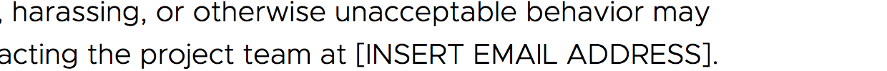

# Code of Conduct Evaluation

About this resource 
===================

Many open source projects now use a code of conduct ("CoC") to define
their standards for community behavior. This resource is intended as a mechanism for both generating, and reviewing a Code of Conduct with three specific goals:

1. Does this Code of Conduct **fully describe, and set a project or event up for success in enforcement**?
2. Does this Code of Conduct effectively signal this project or event as **a welcoming and safe space**?
3. Does this Code of Conduct provide **guidance for building a healthy project or event**?

How To Use This Resource
========================

This resource can be leveraged to:

*  **Review** your new, or existing Code of Conduct.
*  **Evaluate** the Code of Conduct for other projects and/or events.
*  **Better understand the purpose and goals** of a Code of Conduct.

To fully benefit from the potential of this resource we recommend the following steps:

1. **Read the Code of Conduct from top to bottom** and capture initial reactions.  how did it make you feel? Do you see everyone in your community or project represented? Capture your *intuitive response*, as well as factual ones.  
2. **Read this document in its entirety**. Did anything jump out about the Code of Conduct you just read based on the criteria here?  
3. Using this [marking grid](assets/coc-marking-grid.md), step through this document and do a **detailed analysis**.  

**Results from #3 should be organized into one of these three grading categories:**

**Acceptable (<em>Green</em>)**:

    This CoC contains all of the required elements and
    often uses details from the Encouraged examples. It may or may not
    have items from the Additional Elements.

**Needs Improvement (Yellow<em></em>)**:

    This CoC contains most or all of the required
    elements with a mix of encouraged and discouraged text. It can
    move to Acceptable status by updating any missing elements and
    removing discouraged items. One or two red flags in an otherwise
    acceptable policy would also fall into this category.

**Unacceptable (Red<em></em>)**:

    This CoC is missing significant required elements
    and/or contains a number of red flags. It should be rebuilt from
    scratch rather than updated piecemeal.

Review - Focus Areas
=================

While not always explicitly categorized (or organized) this way, these are the primary groups of information we expect to see in a high quality and efficient Code of Conduct and how to evaluate based on.

Look for encouraged and discouraged context, and make notes in [marking grid](assets/coc-marking-grid.md).  The presence of one or more red flags, should result in an immediate 'Unacceptable' grade status.

## 1. Ownership & Location
- [ ] <em>Pass</em>
- [ ] <em>Needs Improvement</em>
- [ ] <em>Fail</em>
_____

There are some excellent templates available for Code of Conduct adoption, but it is important that a CoC is not just a 'copy and past job'.

Miminally, a Code of Conduct should be:

* Locatable in the project repository, easily located all areas of interaction an collaboration.
* On websites, and physical spaces where events are taking place.

#### Red Flags

- A project, or event externally links to a [Code of Conduct template](https://www.contributor-covenant.org/version/1/4/code-of-conduct) templates.
- A project or event uses an unedited copy of a template.  For example, they have not updated even the most basic information.

> 

## 2. Statement of Purpose
- [ ] <em>Pass</em>
- [ ] <em>Needs Improvement</em>
- [ ] <em>Fail</em>
_____

Usually, this is an introductory sentence or section, and should frame the use of a
Code of Conduct within the community’s values and goals.

Below, is an example of a positive purpose statement:

> A primary goal of this project is to be inclusive to the largest
> number of contributors, with the most varied and diverse backgrounds
> possible.[^1]
>
> In the interest of fostering an open and welcoming environment, we as\
> contributors and maintainers pledge to making participation in our
> project and our community a harassment-free experience for
> everyone[^2]

#### Encouraged

The statement should **relate the policy to the general goals of the
project itself**, or the collaboration of working on it: education,
community-building, a shared platform for diverse perspectives, etc.

> Our goal with !!Con is to bring the NYC programming community together
> for a conference about the excitement, joy, and surprise of
> programming.
>
> We value the participation of each member of the community and want
> all attendees to have an enjoyable and fulfilling experience.[^3]

#### Red Flags

-   Any statement that **prioritizes the comfort of existing contributors over the inclusion of people with less status or access**.
-   Statements that put technical outcomes before participatory ones.

Here is a historical example from the Linux Kernal - Code of Conflict.[^4]

> The Linux kernel development effort is a very personal process
> compared to “traditional” ways of developing software. Your code and
> ideas behind it will be carefully reviewed, often resulting in
> critique and criticism. The review will almost always require
> improvements to the code before it can be included in the kernel. Know
> that this happens because everyone involved wants to see the best
> possible solution for the overall success of Linux. This development
> process has been proven to create the most robust operating system
> kernel ever, and we do not want to do anything to cause the quality of
> submission and eventual result to ever decrease.[^4]

## 3. Supported groups
- [ ] <em>Pass</em>
- [ ] <em>Needs Improvement</em>
- [ ] <em>Fail</em>
_____

Also called [protected groups](https://en.wikipedia.org/wiki/Protected_group), supported groups is intended as a reflection of who has been excluded or marginalized in our communities, and industry.

Providing a list of supported groups **signals an accountability for the experiences of all people; all participants in a project, or at an event.**   For those who have regularly been excluded, or hurt by omission this visibity is crucial, and much needed invitation.

Below is a positive example of an inclusive statement:

> We are committed to providing a friendly, safe and welcoming
> environment for all, regardless of level of experience, gender
> identity and expression, sexual orientation, disability, personal
> appearance, body size, race, ethnicity, age, religion, nationality, or
> other similar characteristic.[^5]

At a minimum, the code of conduct should name:

-   Race and ethnicity
-   Gender (identity, expression)
-   Sexuality or sexual orientation
-   Disability (sometimes phrased as “regardless of ability”)
-   Religion

#### Encouraged

-   Age
-   Experience level or job role
-   National origin, citizenship, and immigration status
-   Neurodiversity
-   Mental health
-   Physical appearance, body size
-   Socio-economic status

#### Discouraged

-   Personality traits
-   Other kinds of beliefs
-   Lifestyle and personal behaviors

#### Red Flags

- Anything that doesn’t include specific categories of people.  For example,
“we’re all colleagues” or “treat others as though they were a family
member or loved one”.
- Mention of political parties or beliefs. a project may aim to take an “apolitical” stance.

Some policies also include political parties or beliefs in this section. This is not
effective because there are many kinds of political values, from social
and economic inclusion, to beliefs about legal and bureaucratic
processes, to ones that are about excluding or harming some groups of
people. These varied political alignments do not have equal impacts.

## 4 . Unacceptable Behaviors
- [ ] <em>Pass</em>
- [ ] <em>Needs Improvement</em>
- [ ] <em>Fail</em>
_____

A Code of Conduct, should outline those behaviors with the potential to exclude, marginalize, harm or otherwise deter participation of diverse groups and people.  Articulating these behaviors serves a number of outcomes:

1. Notifies participants of unacceptable behaviors within the context of of social norms.
2. Signals sincerity and intention to address behaviors that harm, exclude and otherwise make participation difficult (if not impossible) for many.
3. Validation what incidents are reportable, should there be self-doubt on behalf of a reporter.

The [Mozilla Community Participation Guidelines](https://www.mozilla.org/en-US/about/governance/policies/participation/) are example of a strong statement against behaviors that exclude diverse people and perspectives:

> The following behaviors are considered to be unacceptable under these guidelines.
> * **Violence and Threats of Violence** are not acceptable - online or offline. This includes incitement of violence toward any individual, including encouraging a person to commit self-harm. This also includes posting or threatening to post other people’s personally identifying information (“doxxing”) online.
> * **Personal Attacks** Conflicts will inevitably arise, but frustration should never turn into a personal attack. It is not okay to insult, demean or belittle others. Attacking someone for their opinions, beliefs and ideas is not acceptable. It is important to speak directly when we disagree and when we think we need to improve, but such discussions must be conducted respectfully and professionally, remaining focused on the issue at hand.
> * **Derogatory Language** Hurtful or harmful language related to: Background, Family status, Gender, Gender identity or expression, Marital status, Sex, Sexual orientation, Native language, Age, Ability, Race and/or ethnicity, National origin, Socioeconomic status, Religion, Geographic location.
> * **Unwelcome Sexual Attention or Physical Contact** Unwelcome sexual attention or unwelcome physical contact is not acceptable. This includes sexualized comments, jokes or imagery in interactions, communications or presentation materials, as well as inappropriate touching, groping, or sexual advances. This includes touching a person without permission, including sensitive areas such as their hair, pregnant stomach, mobility device (wheelchair, scooter, etc) or tattoos. This also includes physically blocking or intimidating another person. Physical contact or simulated physical contact (such as emojis like “kiss”) without affirmative consent is not acceptable. This includes sharing or distribution of sexualized images or text.
> * **Disruptive Behavior**  Sustained disruption of events, forums, or meetings, including talks and presentations, will not be tolerated.
> * **Influencing Disruptive Behavior**  We will treat influencing or leading such activities the same way we treat the activities themselves, and thus the same consequences apply.

 Other examples of unacceptable behavior by participants can include:

-   The use of sexualized language or imagery and unwelcome sexual attention or advances
-   Trolling, insulting/derogatory comments, and personal or political attacks
-   Public or private harassment
-   Publishing others’ private information, such as a physical or electronic address, without explicit permission
-   Other conduct which could reasonably be considered inappropriate in a professional setting[^7]

#### Encouraged

-   The words “harassment”, “abuse”, and “professional” or
    > “professionalism” should be supported by details or definitions.
-   Prohibited or harassing behaviors reflect situations that have
    > occured in the past in open source projects and community spaces.

**NOTE** Many policies prohibit sexual language, imagery, and behavior as
unprofessional, irrelevant, and harassing. For some communities (from
digital archivists to sex workers) there may be sexual content or
discussions that are relevant in that space. **An alternative to a blanket
prohibition could be one that specifies a distinction between relevant
and abusive uses.**

### Discouraged

-   The code of conduct should not punish anyone for not being polite
    > enough or communicating in an unpleasant tone without considering
    > the circumstances.
-   The way people communicate can be judged by its impact and how it
    > reflects the power relationships of the people involved.

### Red flags

-   People who have experienced abuse or harassment should not be prohibited from telling other people about it. Community members should not have to go against the code of conduct to take action.
-   “Reverse racism” or “reverse sexism” as an unacceptable behavior. These kinds of discrimination depend on an imbalance of power, so “racism against white people” isn’t a meaningful concern. Some policies[^8] may state that claims of “**reverse -isms**” will not be acted on and this is fine, especially if there’s a link to a definition so community members can understand the difference.

## 5. Responses/Consequences
- [ ] <em>Pass</em>
- [ ] <em>Needs Improvement</em>
- [ ] <em>Fail</em>
_____

This section should define a range of possible responses from verbal
warnings to long-term removal from participation. Typical responses to a
code of conduct issue include:

-   Verbal warnings

-   Written warnings

-   Temporary absence from participation

-   Long-term absence from participation

-   Being required to follow a conduct agreement that dictates the
    > process of returning to the community

### Examples (acceptable)

> If a community member engages in unacceptable behavior, the community
> organizers may take any action they deem appropriate, up to and
> including a temporary ban or permanent expulsion from the community
> without warning (and without refund in the case of a paid event).[^9]

### Encouraged

-   Multiple possible responses that include short- and long-term
    > consequences

-   Escalating or proportionate consequences based on the scope, impact,
    > and frequency of the incident

-   Defined scope or spaces for the consequence (where enforcement
    > will happen) — IRC, trackers, events, other kinds of contribution

### Red flags

-   Removal from the community as the only possible response to a
    > reported situation[^10]

-   Using the details of past incidents to outline what responses may be
    > taken, even if anonymized or historical. This is harmful to the
    > safety and privacy of all people involved, including reporters.

Scope
-----

This part of the code of conduct indicates who the policy impacts, and
under which situations. It should be specific enough to address most
questions about whether something is happening within or outside of
community governance.

### Examples (acceptable)

> The enforcement policies listed above apply to all official Rust
> venues; including official IRC channels (\#rust, \#rust-internals,
> \#rust-tools, \#rust-libs, \#rustc, \#rust-beginners, \#rust-docs,
> \#rust-community, \#rust-lang, and \#cargo); GitHub repositories under
> rust-lang, rust-lang-nursery, and rust-lang-deprecated; and all forums
> under rust-lang.org (users.rust-lang.org,
> internals.rust-lang.org).[^11]
>
> This code of conduct applies to all spaces managed by the Django
> project or Django Software Foundation. This includes IRC, the mailing
> lists, the issue tracker, DSF events, and any other forums created by
> the project team which the community uses for communication. In
> addition, violations of this code outside these spaces may affect a
> person's ability to participate within them.[^12]

### Encouraged

The minimum scope of the policy should be all normal activities of
project contribution or leadership, including contexts outside the
community where a person is representing the project as a whole. This
may include:

-   commit messages

-   bug trackers

-   IRC channels (listed by name)

-   Email

-   in-person events

-   social media

The statement of scope should be explicit about these spaces and
activities. Other considerations:

-   Make it clear that leaders are held to the same standard as other
    > contributors

-   Define the expectations for employee and volunteer participants, as
    > well as sponsors or other partner organizations.

A statement of scope may mention other contexts where a person’s
behavior affects participation in the project. Some people who wish to
cause harm will try acting just outside the written scope of the code of
conduct, in order to prevent being removed from the community. These are
more difficult situations to respond to, so any extension of scope needs
to be paired with a plan for how it will be monitored and addressed.
It’s reasonable that a code of conduct enforcement team could take
behavior outside the official scope of the CoC into account when
deciding how to respond.

### Red flags

Any policy that explicitly leaves out obvious areas of participation,
like exempting a particular IRC channel or email list, or that defines a
less-stringent standard for some contributors.

This code of conduct does not apply to the core team mailing list.

Contact information
-------------------

This should include at least one way of contacting the code of conduct
response team and name the lead responder — names and contact
information can also be included for additional team members,
leadership, or people in an oversight role.

### Examples (acceptable)

> You can reach Affect’s Code of Conduct team through:

-   our online reporting form
-   email: coc@affectconf.com
-   text/SMS: the number is provided in pre-conference emails and our
    > opening slides
-   finding a Code of Conduct responder in person[^13]

### Encouraged

Contact methods can include:

-   Email
-   Phone

    -   Voice

    -   SMS

    -   Voicemail systems

-   Other direct messaging on communication platforms (Signal, Slack
    > private messages)

Naming multiple responders who can be contacted helps people address
potential conflicts of interest and find someone they are comfortable
talking to.

### Discouraged

-   Web forms without adequate security (SSL/TLS) and privacy policies
    > displayed

-   Bug trackers

-   Public IRC channels

-   Anything where other people could ‘overhear’ or gain access to the
    > report

### Red flags

Unacceptable communication methods:

-   Public or broadcast systems (i.e. ‘tweet at us’)

Information could be sent in this way but it should not be encouraged.

Additional elements
===================

A code of conduct can optionally include other information about
community expectations, and information that helps educate participants
about the use and goals of the code of conduct.

Possible additions:

-   Encouraged behaviors

-   Reporting guidelines

-   Revision history

-   License and attribution

-   Additional resources

Encouraged behaviors
--------------------

Telling participants what you would like them to do shapes the other
side of community participation. In addition to asking them to report
potential code of conduct problems, the policy can have statements about
community practices for working together.

### Examples (encouraged)

> Members of the community are open to collaboration, whether it's on
> PEPs, patches, problems, or otherwise. We're receptive to constructive
> comment and criticism, as the experiences and skill sets of other
> members contribute to the whole of our efforts. We're accepting of all
> who wish to take part in our activities, fostering an environment
> where anyone can participate and everyone can make a difference.[^14]
>
> The following behaviors are expected and requested of all community
> members:

-   Participate in an authentic and active way. In doing so, you
    > contribute to the health and longevity of this community.

-   Exercise consideration and respect in your speech and actions.

-   Attempt collaboration before conflict.

-   Be mindful of your surroundings and of your fellow participants.
    > Alert community leaders if you notice a dangerous situation,
    > someone in distress, or violations of this Code of Conduct, even
    > if they seem inconsequential.[^15]

> In addition to having a code of conduct as an anti-harassment policy,
> we have a small set of social rules we follow.[^16]

Reporting guidelines
--------------------

Reporting guidelines are an additional piece of information that will
help the community understand how the code of conduct is enforced.
Common elements:

-   Information that will be needed to make a report

-   Further contact details or communication channels for the response
    > team

-   Timelines: when will the reporter have a initial response? How long
    > is the process of resolving an issue expected to take?

-   Steps to the response process

-   Possible resolutions

-   Conflict of interest policy

### Examples

> **What happens after you file a report?**
>
> You will receive an email from the DSF Code of Conduct Working Group
> acknowledging receipt immediately. We promise to acknowledge receipt
> within 24 hours (and will aim for much quicker than that).[^17]

Revision history
----------------

This allows community members to determine whether there have been
changes since they last read the code of conduct.

License and attribution
-----------------------

Many of our policies are built on earlier work. Some of these prior
documents are offered under a Creative Commons or other license. Make
sure the text is properly attributed.

Additional resources
--------------------

Codes of conduct may contain other information that is intended to help
participants use or understand the policy.

### Examples

[*FreeBSD Code of
Conduct*](https://www.freebsd.org/internal/code-of-conduct.html)
includes a glossary for the terms “systemic oppression” and “dead
names”.

[*In The Library With The Lead
Pipe*](http://www.inthelibrarywiththeleadpipe.org/conduct/) includes a
further reading list.

### Translations

Having the CoC translated into non-English languages will help global
contributors.

Known problems
==============

Some codes of conduct are poorly structured, contain numerous flags, or
have other warning signs that indicate a lack of enforcement.

There are statements will appear dismissive to people who have
experienced harassment and abuse:

-   “We’re all adults here” — age of participants doesn’t determine
    > whether something causes harm

-   “Be excellent to each other” — this is a cultural reference that not
    > all people will know, and it’s loosely defined

-   “Be nice” — also vague, and puts a higher value on overt politeness
    > over whether harm is caused

-   “Don’t be a dick” or “don’t be an ass” — slang that’s open to
    > interpretation

About intentions — telling community members to assume good or best
intentions is not an effective way to resolve code of conduct issues.
Whether someone intends to cause harm is separate from the impact.

The code of conduct should also not put the burden of response on the
person who has been harmed. Guidelines that tell people to try to
resolve the situation on their own before seeking assistance from a code
of conduct responder are inappropriate.

Be cautious of terms like:

-   Offensive

-   Rude

-   Polite

-   Nice

-   Civil

-   Victim

-   Criminal

All of these can be used to reinforce unequal power dynamics or shame
people away from addressing problems. In addition, whether something is
a criminal or illegal act is separate from whether it is accepted in our
community. Alternate recommendations:

-   Kind

-   Respectful

-   Welcoming

-   Collaborative

-   Appropriate/inappropriate

-   Person who was reported

-   Person who made a report

-   People who were harmed

An assessment of **harm**, **harassment**, or **abuse** should reflect
the impact on the person(s) who it’s directed at. In addition, the
impact on the community as a whole should be taken into account. A
well-worded code of conduct will center these parallel needs.

References
==========

-   [*Safety First PDX resource
    > guide*](http://safetyfirstpdx.org/resources/)

-   [*Citizen Code of Conduct*](http://citizencodeofconduct.org/)

-   [*Contributor Covenant*](https://www.contributor-covenant.org/)

-   Otter Tech [*Evolving Code of Conduct
    > Language*](https://otter.technology/blog/2018/08/09/evolving-code-of-conduct-language/)
    > and [*Code of Conduct Enforcement Warning
    > Signs*](https://otter.technology/blog/2017/12/28/code-of-conduct-enforcement-warning-signs/)

-   [*An Analysis of the Fantasyland Learning Code of
    > Professionalism (FCOP)*](https://subfictional.com/an-analysis-of-the-fcop/)

-   [*The Responsible Communication Style
    > Guide*](https://rcstyleguide.com/)

[^1]: [*Citizen Code of Conduct*](http://citizencodeofconduct.org/)

[^2]: [*Contributor
    Covenant*](https://www.contributor-covenant.org/version/1/4/code-of-conduct)

[^3]: [*!!Con Code of Conduct*](http://bangbangcon.com/conduct.html)

[^4]: [*Linux Kernel Code of
    Conflict*](https://www.kernel.org/doc/html/v4.10/process/code-of-conflict.html)

[^5]: [*Rust Code of
    Conduct*](https://www.rust-lang.org/en-US/conduct.html)

[^6]: [*DjangoCon US Code of
    Conduct*](https://2018.djangocon.us/conduct/)

[^7]: Contributor Covenant

[^8]: [*LGBTQ in Tech Slack*](https://lgbtq.technology/coc.html)

[^9]: Citizen Code of Conduct

[^10]: People will be more reluctant to report an issue if they think
    they’re deciding whether the person they report will be kicked out
    immediately. They may also fear retaliation.

[^11]: [*Rust Code of
    Conduct*](https://www.rust-lang.org/en-US/conduct.html)

[^12]: [*Django Code of
    Conduct*](https://www.djangoproject.com/conduct/)

[^13]: [*Affect Conf Code of Conduct*](https://affectconf.com/coc/)

[^14]: [*Python Community Code of
    Conduct*](https://www.python.org/psf/codeofconduct/)

[^15]: Citizen Code of Conduct

[^16]: !!Con Code of Conduct

[^17]: [*Django
    project*](https://www.djangoproject.com/conduct/reporting/)

[^18]: [*Mozilla
    Community Participation Guidelines*](https://www.mozilla.org/en-US/about/governance/policies/participation/)

License
===================
Creative Commons Attribution [3.0 Unported License](https://creativecommons.org/licenses/by/3.0/).
